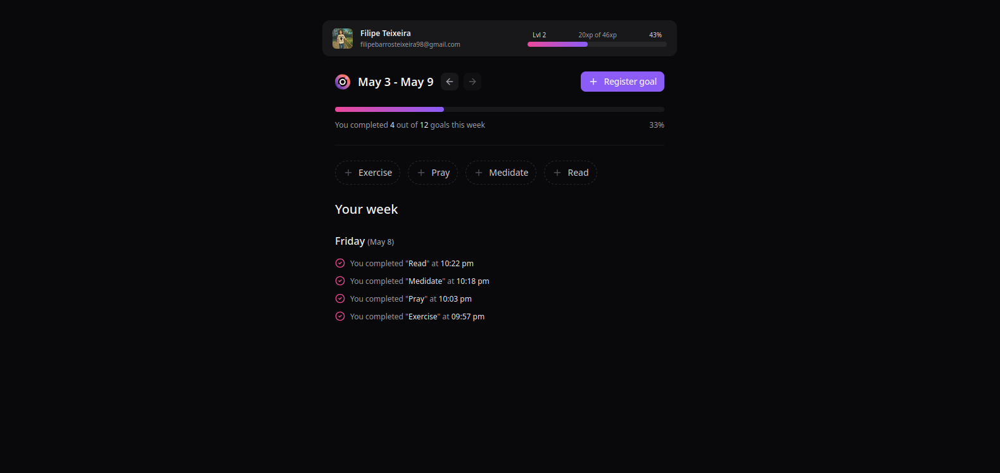

<p align="center" >
  
</p>

<p align="center">
  
  
  
  
  
  
  
</p>

<p align="center">
  <a href="#-technologies">Technologies</a>&nbsp;&nbsp;&nbsp;|&nbsp;&nbsp;&nbsp;
  <a href="#-project">Project</a>&nbsp;&nbsp;&nbsp;|&nbsp;&nbsp;&nbsp;
  <a href="#-layout">Layout</a>&nbsp;&nbsp;&nbsp;|&nbsp;&nbsp;&nbsp;
  <a href="#-license">License</a>
</p>

<p align="center">
  
</p>

<p align="center">
  
</p>

## 🚀 Technologies

This project was developed with the following technologies:

- **Node.js**
- **TypeScript**
- **Fastify**
- **Drizzle ORM**
- **PostgreSQL**
- **Zod**
- **Day.js**
- **Faker.js**
- **Vitest**
- **Biome.js**
- **Docker Compose**

## 🚧 Project

In.Orbit is a full-stack web application meticulously crafted to help users bridge the gap between intention and action. By transforming abstract ambitions into a structured weekly roadmap, In.Orbit empowers individuals to plan, track, and conquer their goals with precision.

Designed with a UX-first philosophy, the application strips away the friction of traditional habit trackers, offering a sleek, intuitive interface that makes visualizing progress feel less like a chore and more like a journey.

## 🧰 Prerequisites

- Node.js (version 18 or later)
- `npm` or `yarn`

## 💻 How to run

```bash
# Clone the repository
git clone https://github.com/filipebteixeira98/inorbit-api.git

# Access the project folder
cd inorbit-api

# Install the dependencies
npm install
```

_Create a `.env` file based on `.env.example`_

Example:

```env
NODE_ENV=

DATABASE_URL=

GITHUB_CLIENT_ID=
GITHUB_CLIENT_SECRET=

JWT_SECRET=
```

```bash
# Start infrastructure
docker compose up -d
```

This starts:

- PostgreSQL on port `5432`

```bash
# Apply the database schema
npx prisma migrate dev

# If you only want to sync the schema without creating a migration
npx prisma db push

# Run the server (The API will be available at: http://localhost:3333)
npm run dev
```

## 🫶 Contributing

Contributions are welcome! Please feel free to submit a Pull Request.

## 📝 License

This project is under the MIT license.

<p align="center">
  Made with ♥ by me
</p>
